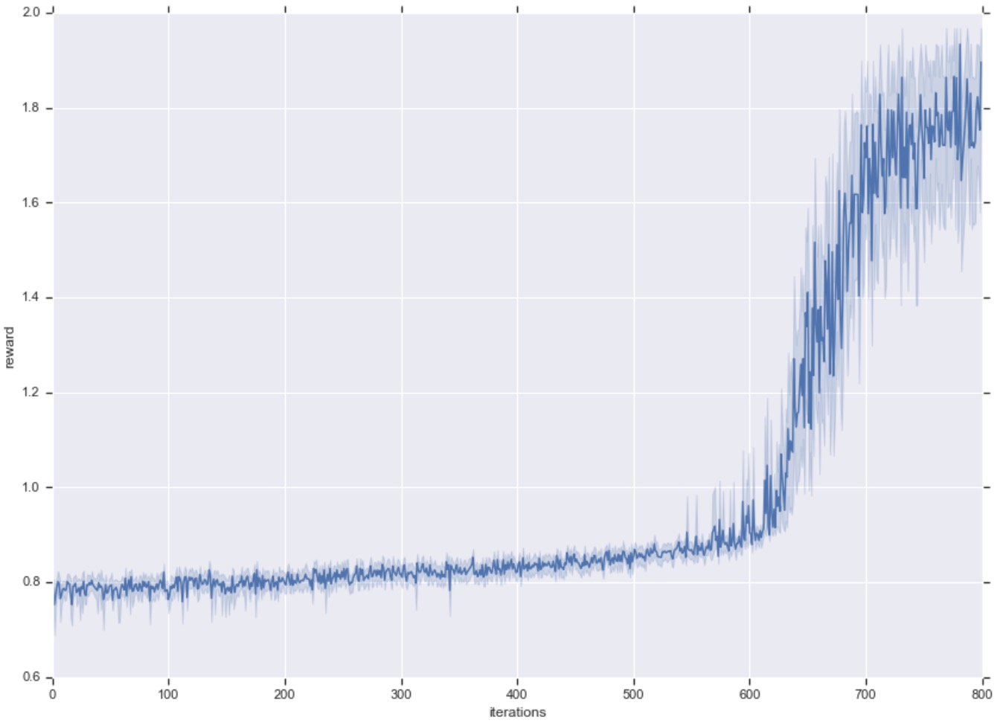
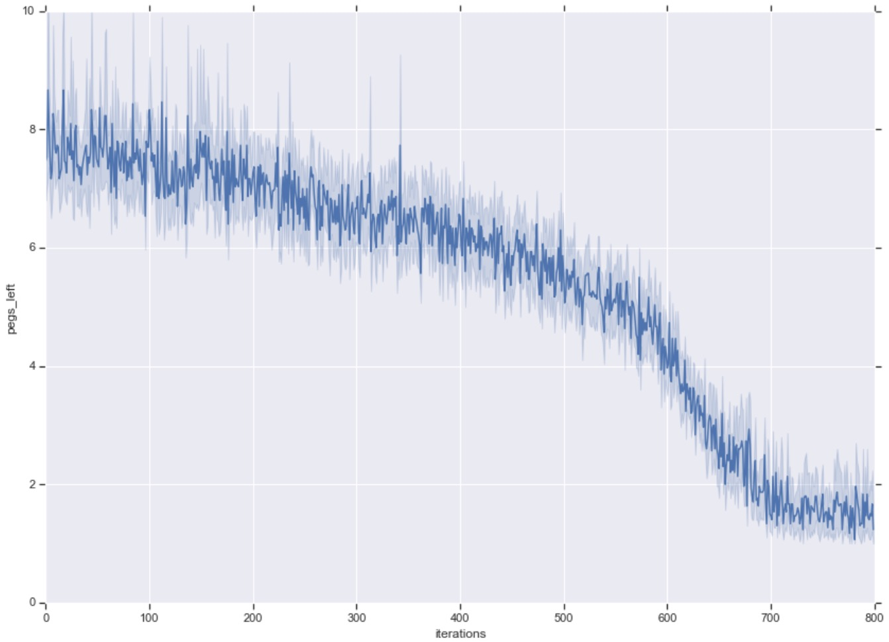
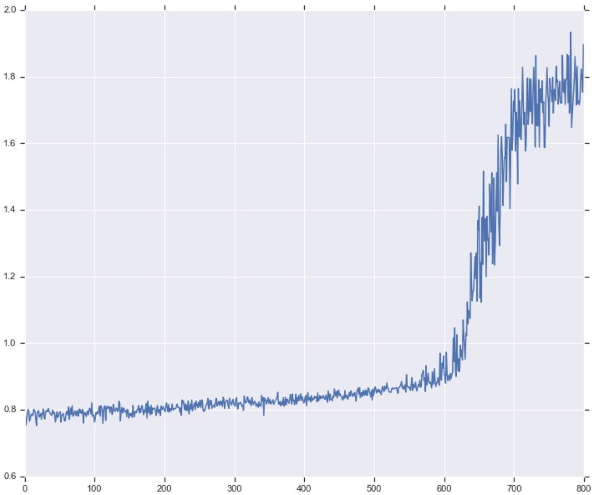
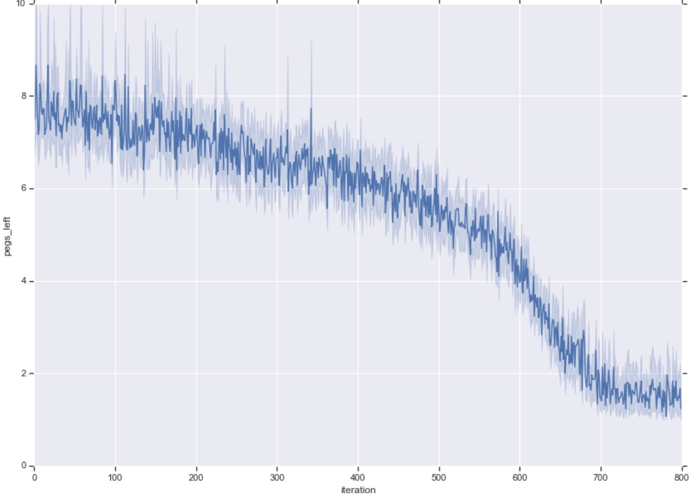

# RL-solitaire
Solving the game of peg solitaire with a Reinforcement Learning (RL) Algorithm. 

I used an adapted version of Asynchronous Advantage Actor Critic ([A3C](https://arxiv.org/pdf/1602.01783.pdf)) which I implemented from scratch myself to train an RL agent to solve the game of peg solitaire. The game consists of 32 marbles (or pegs) set out in a cross shape. There are 33 positions in the cross-shaped board, and the initial position of the game contains all 32 marbles but one is missing in the center position of the cross. The goal is to remove the marbles one by one until there is only one left. To remove a marble, another marble has to move to an empty space and pass over the marble to remove. 

See the gif demo below to better understand the game : 

<p align="center">

</p>

It is fairly easy to leave between 2 and 5 marbles at the end of the game, but much more difficult to leave only 1. This is why this game is difficult for a reinforcement learning algorithm, since it can easily learn to get high rewards by leaving only a few marbles, but it has to leave even less than 2 marbles to solve the game. 

# Files Description 

- The folder *env* contains three files : *env.py*, *rendering.py* and *border_constraints.py*. The first file contains the implementation of the soliatire environment as a Python Class <b>Env</b> and the basic functions (init, step, reset, etc) that will be used to interact with it. It also contains a function (render) to visualize the environment. The file *border_constraints.py* contains a function to compute the actions which would yield a marble out of the borders of the board. 

- The file *agent.py* contains the implementation of different classes of agents. The basic core class and its methods are described first, then the classes <b>RandomAgent</b> and <b>ActorCriticAgent</b> are implemented using the base methods from the parent class <b>Agent</b>. The actor-critic agent implements A3C and consists of a neural network implemented in the file *network.py* found in the folder *network*.

- The folder *network* contains two python files *network.py* and *build.py*. The former contains a Python Class <b>Net</b> implementing a neural network in TensorFlow with a shared representation of the state which then splits into two heads: the policy head and the value head. The latter file contains the functions to build the different blocks of the network. 

- The file *buffer.py* contains a small Python Class implementing a buffer structure. This buffer will be used as a memory replay buffer during the training of the agent. The buffer has a fixed capacity, and once it is reached, each time new data are added, the oldest data removed.

- The file *util.py* contains utility functions to handle files and directories and other such handy functions.

- The file *config.yaml* contains the configuration parameters (directory names, hyperparameters of the network, number of workers, etc) for training the agent.

- The file *main.py* contains the main file for training the agent. The config file is read and then the training of the agent can start with the parameters found in the configuration file.


# Description of the Method

I used a slightly adapted version of A3C, which I implemented myself, in which a certain number of games (here 16) are played simultaneously using the same agent (i.e. the same policy network). The data from those games are collected and stored in a memory buffer as a list of dictionnaries whose keys are <b>state</b>, <b>advantage</b>, <b>action selected</b>, and <b>critic target</b>. After every 4 moves played by the agents, data are sampled from the buffer and used to update the policy-value network of the agent using mini-batch gradient descent (using a batch size of 64, and the Adam optimizer). One iteration of training consists of playing out until the end the 16 games simultaneously and updating the network every time all of the 16 agents have taken 4 moves. At the end of each iteration, the network weights are saved, and an evaluation phase starts where the results of 30 games (played simultaneously with the latest update of the network) are collected and stored in a results file for later analysis. 

The network design has been kept simple, although a more complex architecture would have yielded a faster learning. The input to the network is the state of the environment represented by a 7x7x3 cube, i.e. a 7x7 image with 3 channels (I have used the NHWC covention for TensorFlow tensors). The first channel contains integers 1 and 0 to indicate presence or abscence of a marble at each position. The positions outside the cross-shaped board are automatically filled with zeros. The two other channels contain each a single value broadcasted to the whole channel matrix. The first of those channels contains the percentage of marbles that have been removed so far, and the last contains the percentage of marbles left to remove in order to solve the game. 

The policy-value network first processes that input using three 2d-convolutions. Then, this state representation is processed separately by the value head and the policy head. The value head consists of a 1x1 convolution  with stride 1, followed by a dense layer and then the output layer. The policy head consists of a 1x1 convolution with stride 1 followed by a dense layer giving the logits of a softmax distribution. 

At each state of a game, we store the cube representation of the state. The critic target for this state is computed using the rewards cumulated during the 4 moves in which this state was observed as well as the value network for bootstrapping. The value network is used both to evaluate the value of the last state reached after the 4 moves and thus to obtain the critic target values, but also to evaluate each of the 4 states encountered, whose values will serve as baseline when computing the advantage for each of these for states. The action selected by the agent is also stored in order to train the actor (policy network). 

# Running the agent

To start training the agent, simply run from the root directory of the project :

```bash
python main.py
```

This will create or empty the necessary directories, and then start the training process. The network model will be saved at each iteration, the losses and network gradients and variables information will be logged to be displayed in TensorBoard, and the logs of the evaluation results will also be stored to be further analysed later on. 

To visualise the logs during training, under the directory name_of_the_agent/tensorboard/ (in my case, with the config file given, actor-critic/tensorboard/), run :

```bash
tensorboard --logdir . 
```

and then go to http://localhost:6006/ in your browser.

At the end of training, if you wish to see a demo of the agent completing the game, run the following commands in an ipython shell from the root directory of the project : 

First import the necessary packages

```python
from env.env import Env
from agent import ActorCriticAgent
```

Then read the config file

```python
config = read_config("config.yaml")
agent_config = config['Agent']
network_config = agent_config['Network']
```

Then initialize the environment and the agent. (Don't forget to set restore=True in order to restore the latest version of the agent, and render=True to visualise the agent playing. The name 'actor-critic' in the checkpoint_dir argument might needed to be changed according to the name you chose for your agent in the config file.)

```python
env = Env()
agent = ActorCriticAgent(agent_config, network_config, checkpoint_dir='actor-critic/checkpoints/',
                         tensorboard_log_dir='actor-critic/tensorboard/', restore=True, render=True)
```

Finally run the agent to see him solve the game of solitaire :

```python
agent.play(env)
```

# Training and results

With the configuration parameters as presented in the config file, training took 53 minutes on one CPU to complete the 800 iterations. At the end of training, the agent is able to solve the puzzle almost every time when sampling from the policy, and solves the puzzle every time when using a greedy policy, i.e. selecting at each move the most probable action from the policy. From the 700th training iteration, the agent solved the puzzle 99% of the time during evaluation. It thus takes a little more than 11 000 games for the agent to figure out how to solve the puzzle ! This corresponds to roughly 50 000 network updates. Below are depicted the curves (mean and standard deviation) of the cumulative reward (left) and number of marbles left (right) in the evaluation games as a function of the number of iterations. 

<p align="center">
  
  
</p>

<!-- <p align="center"> <font size="2">Reward vs. iterations</font> &emsp <font size="2"> Number of marbles left vs. iterations </font> <p align="center">
	 	 Reward vs. iterations	 	 	 Number of marbles left vs. iterations -->


<!-- <p align="center">

</p>
<p align="center">Reward as a function of the number of iterations<p align="center">

<p align="center">

</p>
<p align="center">Number of marbles left as a function of the number of iterations<p align="center"> -->

Finally, you can observe in the gif below the agent solving the puzzle. The solution is produced using the latest version of the network and using a greedy policy (most probable move is selected at each step) : 

<p align="center">

</p>
