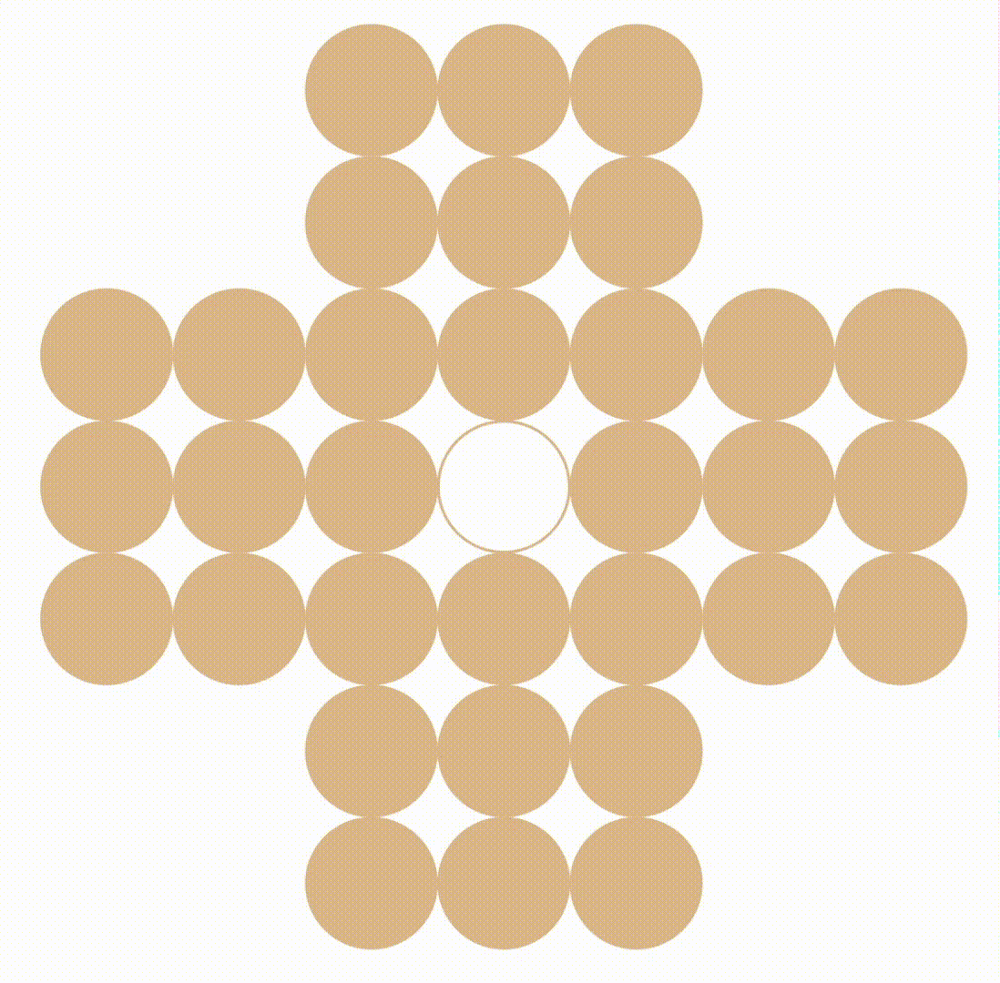
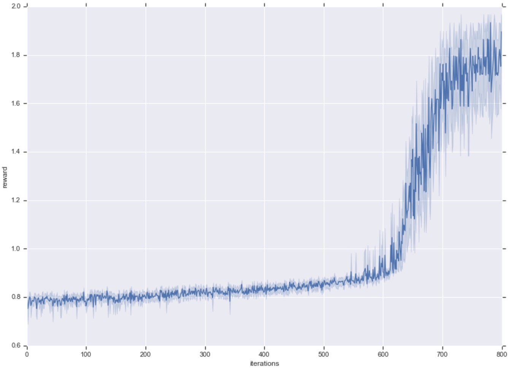
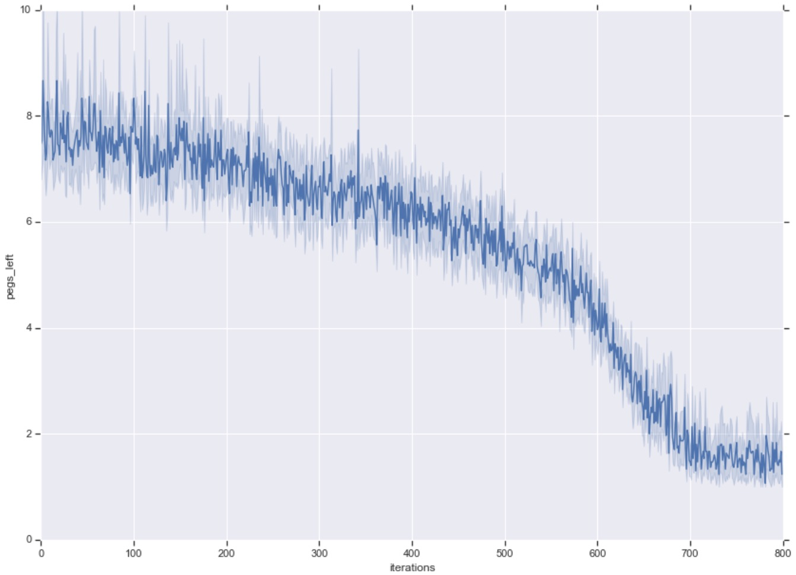

# RL-solitaire
Solving the game of peg solitaire with a Reinforcement Learning (RL) Algorithm. 

I used an adapted version of Advantage Actor Critic ([A2C](https://arxiv.org/pdf/1602.01783.pdf)) which I implemented from scratch myself to train an RL agent to solve the game of peg solitaire. The game consists of 32 marbles (or pegs) set out in a cross shape. There are 33 positions in the cross-shaped board, and the initial position of the game contains all 32 marbles but one is missing in the center position of the cross. The goal is to remove the marbles one by one until there is only one left. To remove a marble, another marble has to move to an empty space and pass over the marble to remove. 

See the gif demo below to better understand the game : 

<p align="center">

</p>

It is fairly easy to leave between 2 and 5 marbles at the end of the game, but much more difficult to leave only 1. This is why this game is difficult for a reinforcement learning algorithm, since it can easily learn to get high rewards by leaving only a few marbles, but it has to leave even less than 2 marbles to solve the game. 

# Files Description 

- The folder *env* contains three files : *env.py*, *rendering.py* and *border_constraints.py*. The first file contains the implementation of the solitaire environment as a Python Class <b>Env</b> and the basic functions (init, step, reset, etc) that will be used to interact with it. It also contains a function (render) to visualize the environment. The file *border_constraints.py* contains a function to compute the actions which would yield a marble out of the borders of the board. 

- The file *agents* contains the implementation of different classes of agents. The basic core class and its methods are described first, then the classes <b>RandomAgent</b> and <b>ActorCriticAgent</b> are implemented using the base methods from the parent class <b>Agent</b>. The actor-critic agent implements A2C and consists of a neural network implemented in the folder *nn*.

- The folder *nn* contains different types of NN architectures. 

- The file *run.py* contains the main file for training the agent. The config file is read and then the training of the agent can start with the parameters found in the configuration file.


# Description of the Method

I used a slightly adapted version of A2C, which I implemented myself, in which a certain number of games are played using the same agent (i.e. the same policy network). One iteration of training consists of playing out a number of games until the end and updating the network afterwards. At the end of each iteration, the network weights are saved, and an evaluation phase starts where the results of 50 games. 

The input to the network is the state of the environment represented by a 7x7x3 cube, i.e. a 7x7 image with 3 channels. The first channel contains integers 1 and 0 to indicate presence or absence of a marble (peg) at each position. The positions outside the cross-shaped board are automatically filled with zeros. The two other channels contain each a single value broadcasted to the whole channel matrix. The first of those channels contains the percentage of marbles that have been removed so far, and the last contains the percentage of marbles left to remove in order to solve the game.   

# Running the agent

To start training the agent, simply run from the root directory of the project :

```bash
python run.py --agent_name=agent_name --network_name=network_name
```

This will create or empty the necessary directories, and then start the training process. The network model will be saved at each iteration, the losses and network gradients and variables information will be logged to be displayed in TensorBoard or Neptune, and the logs of the evaluation results will also be stored to be further analysed later on. 

To visualise the logs during training, under the directory name_of_the_agent/run_name/ run :

```bash
tensorboard --logdir . 
```

and then go to http://localhost:6006/ in your browser. If you are using the Neptune logger, logs will automatically appear in your Neptune project browser: go to [https://app.neptune.ai/o](https://app.neptune.ai/o) and go to your project name to check your latest run.

At the end of training, if you wish to see a demo of the agent completing the game, run the following command : 

```python
agent.play(env, render=True)
```
where agent is the agent you have imported and loaded from a given checkpoint.

# Training and results

With the configuration parameters as presented in the config file, training took 53 minutes on one CPU to complete the 800 iterations. At the end of training, the agent is able to solve the puzzle almost every time when sampling from the policy, and solves the puzzle every time when using a greedy policy, i.e. selecting at each move the most probable action from the policy. From the 700th training iteration, the agent solved the puzzle 99% of the time during evaluation. It thus takes a little more than 11 000 games for the agent to figure out how to solve the puzzle ! This corresponds to roughly 50 000 network updates. Below are depicted the curves (mean and standard deviation) of the cumulative reward (left) and number of marbles left (right) in the evaluation games as a function of the number of iterations. 

<p align="center">
  
  
</p>

<!-- <p align="center"> <font size="2">Reward vs. iterations</font> &emsp <font size="2"> Number of marbles left vs. iterations </font> <p align="center">
	 	 Reward vs. iterations	 	 	 Number of marbles left vs. iterations -->


<!-- <p align="center">

</p>
<p align="center">Reward as a function of the number of iterations<p align="center">

<p align="center">

</p>
<p align="center">Number of marbles left as a function of the number of iterations<p align="center"> -->

Finally, you can observe in the gif below the agent solving the puzzle. The solution is produced using the latest version of the network and using a greedy policy (most probable move is selected at each step) : 

<p align="center">

</p>
